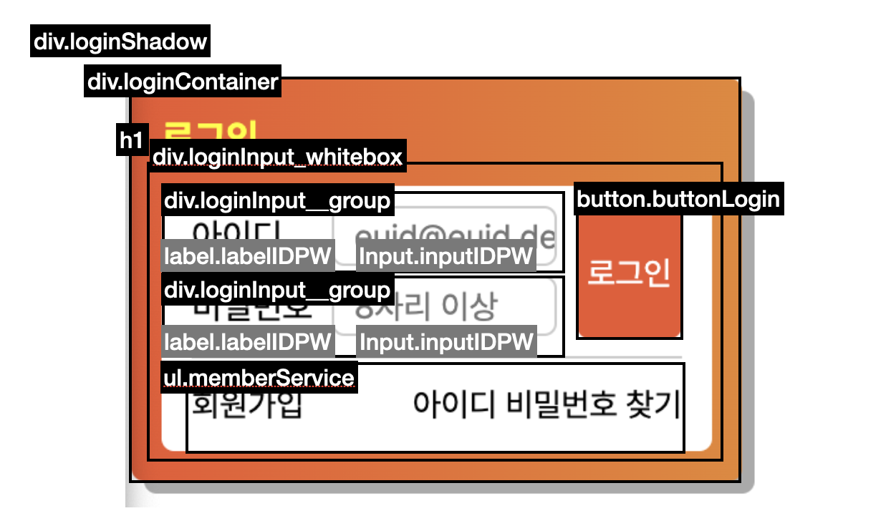
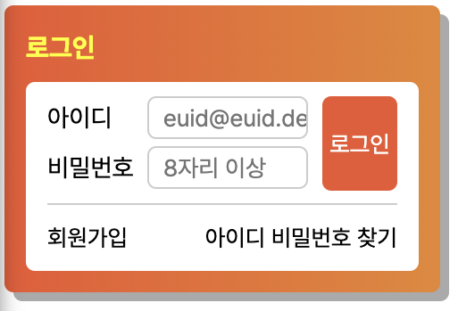
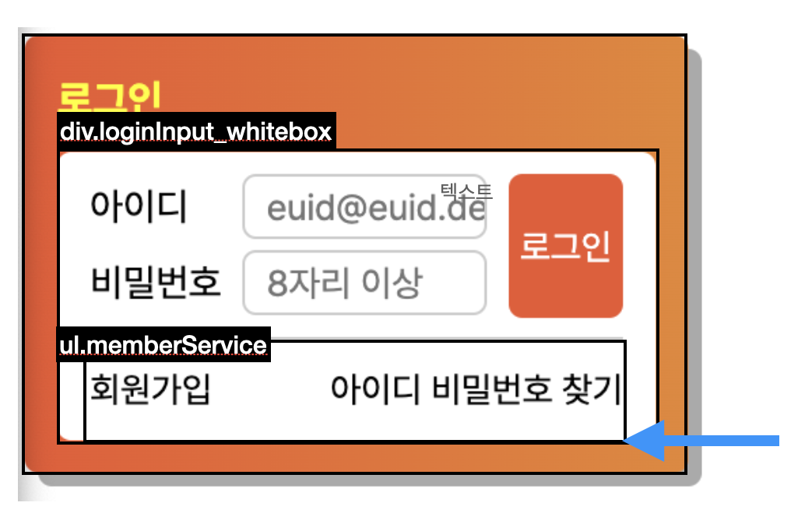

# [HTML/CSS] 로그인 폼

## **1. Requirements**

- 파일: login.html, login.css
- 마크업 순서
  1. 로그인(제목)
  2. 아이디 레이블과 입력서식
  3. 비밀번호 레이블과 입력서식
  4. 로그인 버튼
  5. 회원가입 및 아이디/비밀번호 찾기 링크
- 필수사항
  - 이미지 assets 사용하지 않음.
  - 일부 요소 position 속성 활용
  - 회원가입, 아이디/비밀번호 찾기 영역은 float 활용
  - README.md 파일 생성 후 설명
  - 스크린샷 삽입
     
     

---

## **2. HTML Markup**

div.loginShadow (그림자용)

- div.loginContainer (오렌지박스)
  - h1 (로그인)
  - div.loginInput_whitebox
    - form.loginForm > fieldset > legend
      - div.loginInput\_\_group
        - label.labelIDPW
        - input.inputIDPW (required)
      - div.loginInput\_\_group
        - label.labelIDPW
        - input.inputIDPW (minlength="8")
      - button.buttonLogin
    - ul.memberService
      - li.join
      - li.forgot

 
* tab index 는 로그인, 아이디 label, 아이디 input, 비밀번호 label, 비밀번호 input, 로그인 버튼, 회원가입 링크, 아이디 비밀번호 찾기 링크 순으로 설정하였음. (voiceover 로 테스트 완료)

 
 

 
 

---

## **3. CSS Summary**

1. 초기화 및 기본 세팅
   - box-sizing: border-box;
   - font-family: 'Pretendard';
   - list-style-type: none;
   - 등등
      
2. (생략 - 로그인 박스 그림자, 로그인 박스, 로그인 제목)
3. 로그인 폼 내부의 하얀색 박스
   - position: relative;
4. 라벨
   - display: block;
   - float: left;
5. 인풋
   - border: 1px solid #cccccc;
   - border-radius: 5px;
   - padding: 1.5px 0 1.5px 8px;
6. 버튼
   - position: absolute;
   - right: 0.75rem;
   - top: 0.5rem;
7. 회원가입/아이디 비밀번호 찾기 공통
   - position: relative;
   - top: 50%;
   - transform: translateY(-50%);
8. 회원가입
   - float: left
9. 아이디 비밀번호 찾기
   - float:right

 
 

---

## **4. Screenshot**

 
 

---

## **5. Questions**

1. 하얀색 박스 위에 ul 을 배치시켜서, ul 의 border-top 으로 회색 선을 만들어야 그 길이가 적절한 것으로 보였습니다.
    
   따라서 아래와 같이 구상하였으나, ul 의 높이를 설정하는 것이 생각보다 어려웠습니다. 결국 figma 에서 보이는 픽셀값으로 설정하였으나, 다른 방법은 없을까요? bottom:0%; 와 같은 방식은 적용되지 않았는데 이유를 찾지 못했습니다. 아니면 애초에 불가능한 방법/어렵게 돌아가는 방법으로 구상했던 걸까요?

  
 
 

2. 로그인, 아이디 등 글자를 배치하는 경우 block 의 위치에는 문제가 없으나, block 내부에 적히는 글자의 위치가 위로 올라가거나 하는 경우가 발생하였습니다. 그때마다 line-height: 24px; 와 같이 line-height 를 픽셀 단위로 고정하여 마치 제가 원하는 높이의 block 안에서 가운데 (y축 기준) 에 위치하는 것 처럼 보이게 만들었으나, 올바른 방법이 아닌 것 같아 질문드립니다.

3. Voiceover 로 테스트하였을 때, 제 마크업 때문인지 label 인식 시, '아이디, 그룹', '비밀번호, 그룹' 과 같은 식으로 그룹이라는 말이 뒤에 꼭 붙게 되던데 voiceover 사용자 입장에서 이 그룹이라는 안내가 필요한 것인가요? 불필요하다면 어떻게 없애야할까요? 아이디 label 이 input 과 묶여있는 div 태그 때문인가 싶어 div.loginInput\_\_group 에 aria-hidden="true" 를 주었더니, 아이디 label 자체가 읽히지 않았습니다.
