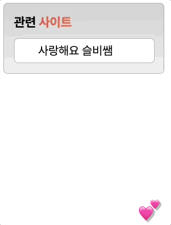

# [멋쟁이사자처럼 프론트엔드스쿨 6기] Transition 과제

## 1. UI Screenshot



<br>

## 2. HTML Markup

### [마크업 한 눈에 보기]


<br>

- div.webBox (회색 전체 박스)
  - h3 > span (관련 사이트)
  - ul.webList (리스트)
    - li.webList\_\_item (리스트 아이템))

### [HTML]

```html
<body>
  <div class="webBox">
    <h3 tabindex="1">관련 <span>사이트</span></h3>
    <ul class="webList" tabindex="2">
      <li class="webList__item">사랑해요 슬비쌤</li>
      <li class="webList__item">열심히 배워서</li>
      <li class="webList__item">슬비쌤의</li>
      <li class="webList__item">자랑스러운</li>
      <li class="webList__item">제자가 될게여</li>
    </ul>
  </div>
</body>
```

<br>

## 3. CSS Styling

### [Transition 관련 부분 발췌]

<br>

ul 태그 hover 전

```css
.webList {
  height: 29px;
  padding: 0 0 0 24px;
  overflow: hidden;
  transition-property: height, padding-top;
  transition-timing-function: ease-in-out;
  transition-duration: 0.5s, 0.5s;
  transition-delay: 0s, 0.5s;
}
```

> height 를 line-height 및 padding 값을 더한 29px 로 지정해두고, overflow 된 list 는 보이지 않게 설정함.

> ease-in-out 으로 애니메이션 시작과 끝이 자연스럽게 이어지도록 함.

> 글자는 반박자 늦게 내려오도록 delay 값 설정함.

ul 태그 hover 후

```css
.webList:hover {
  height: 165px;
  padding-top: 10px;
}
```

> height 는 165px 로 길어지고, padding-top 을 주어 165px 기준 리스트가 중앙 정렬되게 하였음.

<br>

## 4. Voiceover Test


