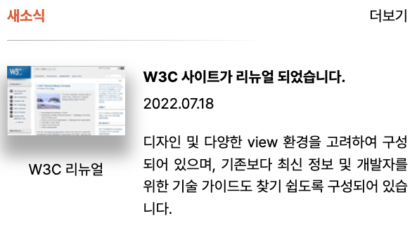
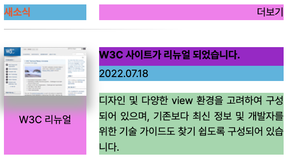

# [멋쟁이사자처럼 프론트엔드스쿨 6기] Grid 과제

## 1. Screenshot

---



> 결과 Screenshot

## 2. HTML Markup

---

### 1. Markup Order

1. 새소식
2. 새소식 내부 제목 및 날짜 (W3C 사이트가 리뉴얼 되었습니다. 2022.07.18.)
3. 새소식 내용
4. 이미지 figure > img, figcaption
5. 더보기

> 스크린리더가 읽어주는 순서로 생각했을 때, 새소식 section 임을 알리고, text 를 모두 읽은 뒤, 이미지를 안내하고, 모든 컨텐츠 읽기가 끝난 후 '더보기' 로 넘어가는 것이 합리적인 순서라고 생각하였습니다.

<br/>

**HTML 발췌**

```html
<section class="newsContainer">
  <h2 class="news">새소식</h2>
  <div class="line" aria-hidden="true"></div>
  <p class="title">
    W3C 사이트가 리뉴얼 되었습니다. <br />
    <span class="date">2022.07.18</span>
  </p>
  <figure class="image">
    
    <figcaption>W3C 리뉴얼</figcaption>
  </figure>
  <p class="summary">디자인 및 다양한 view 환경을 고려하여 구성되어 있으며, 기존보다 최신 정보 및 개발자를 위한 기술 가이드도 찾기 쉽도록 구성되어 있습니다.</p>
  <p class="more">더보기</p>
</section>
```

## 2. CSS Styling

---



> 각 grid 칸의 범위 확인을 위한 Screenshot

<br/>

**CSS 발췌**

```css
.newsContainer {
  display: grid;
  width: 380px;
  grid-column: 2fr;
  grid-row: 4fr;
  grid-gap: 12px 17px;
  grid-template-areas:
    "news more"
    "line line"
    "image title"
    "image summary";
  font-size: 14px;
}
```

container 는 width 값만 설정해주었으며, 열은 2fr, 행은 4fr 로 구분하였습니다.

<br/>

## 3. Issue

---

이미지 자체에 그림자가 있어서 figma 에 명시된 대로 width: 112px 로 주어도, 마치 image 에 margin 이나 padding 이 있는 것 같은 모양으로 배치되어 레이아웃이 다소 달라보이는 이슈가 있었으나, 해결방법을 찾지 못했습니다.
