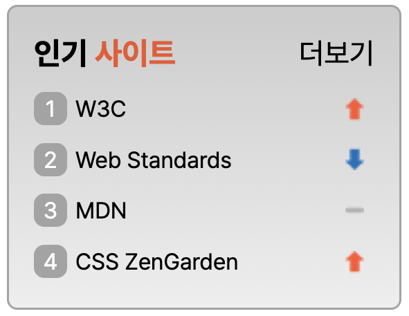
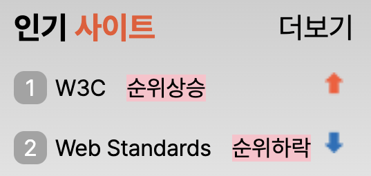

# [멋쟁이사자처럼 프론트엔드스쿨 6기] Sprite 과제

## 1. Screenshot

---



> 결과 Screenshot

## 2. HTML Markup

---

### 1. Markup Order

1. 인기 사이트 제목
2. ol > li\*5
3. li 내부에 스크린리더용 문구
4. 더보기 링크

> 스크린리더가 읽어주는 순서로, 인기 사이트 제목 후 리스트 아이템을 차례대로 읽어준 후 더보기 링크를 선택할 수 있도록 하였습니다. 다만, 순위상승/하락/유지 아이콘이 시각장애 및 저시력 사용자들에게는 제공될 수 없는 정보로 판단하여, 추가 span 을 작성하였습니다.

<br/>

**HTML 일부 발췌**

```html
<section class="webContainer">
  <h2 class="title">인기 <span class="orange">사이트</span></h2>
  <ol class="webRank">
    <li class="webRank__item sprite spriteUp">W3C<span class="updown a11yHidden">순위상승</span></li>
    <li class="webRank__item sprite spriteDown">Web Standards<span class="updown a11yHidden">순위하락</span></li>
    <li class="webRank__item sprite spriteStay">MDN<span class="updown a11yHidden">순위유지</span></li>
    <li class="webRank__item sprite spriteUp">CSS ZenGarden<span class="updown a11yHidden">순위상승</span></li>
  </ol>
  <a href="/" class="more">더보기</a>
</section>
```

## 2. CSS Styling

---

**CSS 일부 발췌**

```css
.webContainer {
  position: relative;
}
```

> 인기 사이트 전체 container

```css
.more {
  position: absolute;
  top: 12px;
  right: 12px;
  font-size: 14px;
}
```

> 더보기 링크 position: absolute; 로 위치

```css
.webRank__item::before {
  display: inline-block;
  content: counter(number);
}
```

> 순위 숫자는 ::before 가상화 요소로, content: counter(number) 로 선언

```css
.sprite {
  background-color: aqua;
  background: url(./assets/rank.png) no-repeat;
}

.spriteUp {
  background-position: 150px 3px;
}

.spriteStay {
  background-position: 150px -19px;
}

.spriteDown {
  background-position: 150px -42px;
}
```

> sprite 는 육안으로 최대한 라인에 맞는 위치에 자리잡도록 하였으며, px 단위로 조정하며 fix 함

## 3. a11yHidden

---



> a11yHidden 클래스가 없는 경우. 스크린더 사용자 예시.
